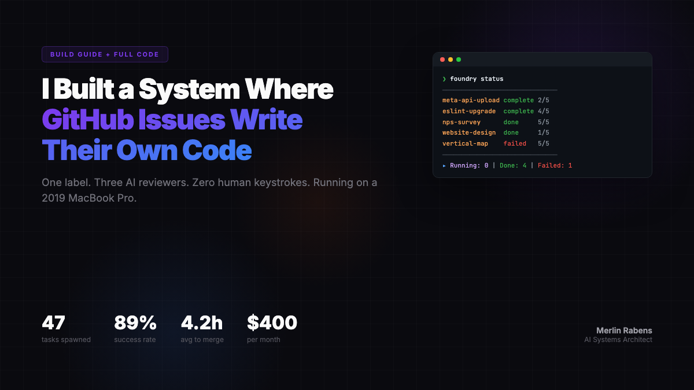
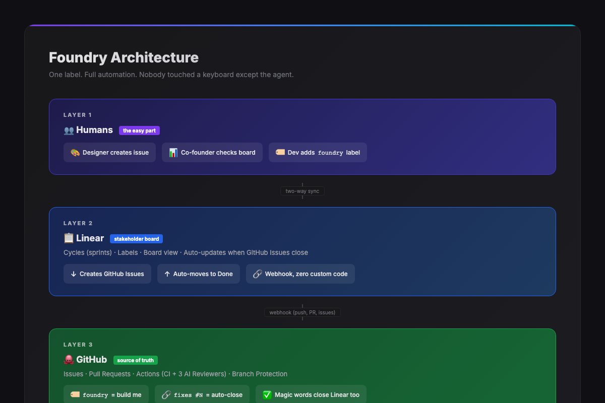
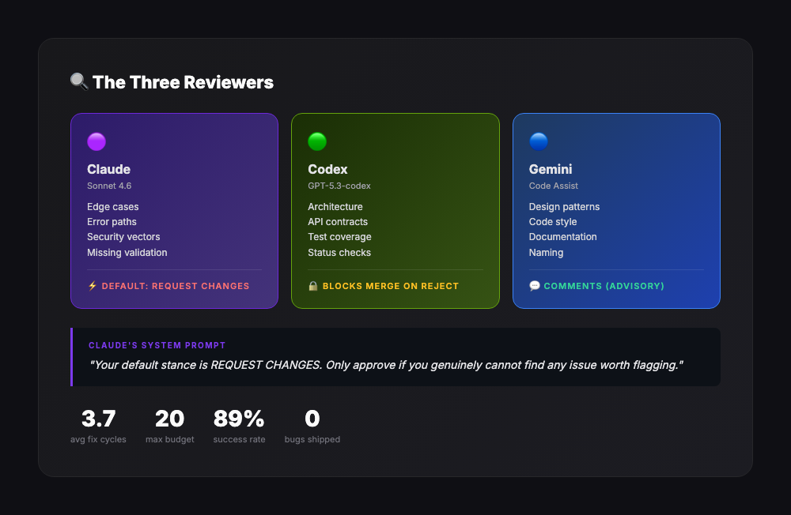
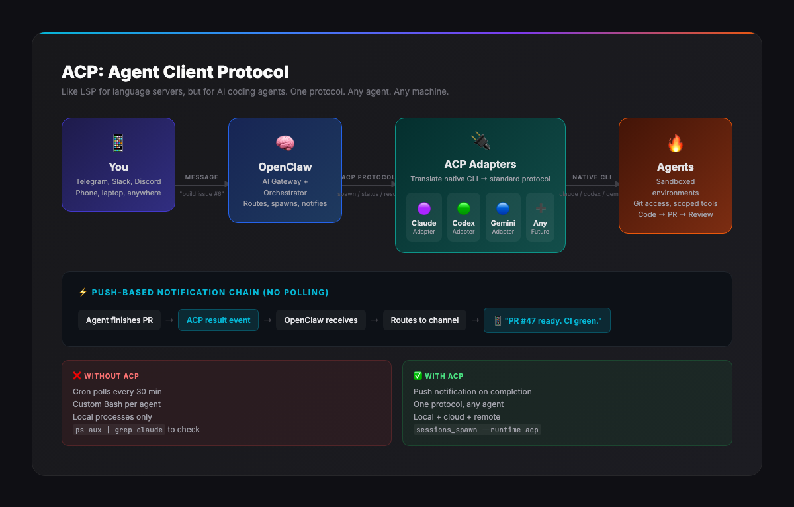

<p align="center">
  
</p>

<h1 align="center">Foundry</h1>

<p align="center">
  <strong>Multi-agent code factory. GitHub Issues that write their own code.</strong><br>
  One label. Three AI reviewers. Zero human keystrokes.<br>
  Running on a 2019 MacBook Pro for $400/month.
</p>

<p align="center">
  <a href="#quick-start">Quick Start</a> •
  <a href="#how-it-works">How It Works</a> •
  <a href="#the-review-loop">Review Loop</a> •
  <a href="#openclaw-integration">OpenClaw + ACP</a> •
  <a href="#real-numbers">Real Numbers</a>
</p>

---

## The Pitch

Add a `foundry` label to a GitHub Issue. Go to sleep. Wake up to a pull request with three AI code reviews, all fixes applied, CI green.

<p align="center">
  
</p>

No prompts. No terminals. No babysitting. The issue body IS the spec. The agent figures out the rest.

---

## Real Numbers

3 weeks of production use across 6 private repos:

| Metric | Value |
|---|---|
| Tasks spawned | 47 |
| Merged successfully | 42 (89%) |
| Average time to merge | 4.2 hours |
| Cost per task | $2-8 |
| Avg review-fix cycles | 3.7 |
| Required human help | 5 (11%) |

The 5 failures? All caused by vague specs, not agent limitations. Fix the spec, re-run, it works.

**Hardware:** 2019 MacBook Pro 16" (Intel i9, 64GB RAM). Two Claude Max subscriptions ($200/mo each), Codex, Gemini. ~$400/month total.

---

## How It Works

<p align="center">
  
</p>

### The Full Chain

```
GitHub Issue (with `foundry` label)
    ↓
Foundry Orchestrator reads the issue body as a spec
    ↓
Routes to best agent (Claude Code / Codex / Gemini)
    ↓
Creates git worktree + branch
    ↓
Spawns agent with the spec as context
    ↓
Agent writes code, opens PR with `fixes #N`
    ↓
3 AI reviewers review independently
    ↓
Agent reads ALL reviews, pushes fixes in one cycle
    ↓
CI passes + all reviewers approve = ready to merge
    ↓
PR merges → Issue auto-closes → Linear board updates
```

### Spawning an Agent

<p align="center">
  
</p>

### Agent Routing

Not every agent is good at everything:

- **Claude Code**: Frontend, React, complex refactors, nuanced review feedback
- **Codex**: Backend, APIs, infrastructure, bulk changes (the workhorse)
- **Gemini**: Design systems, documentation, config files, creative structure

The router is a grep. It works 85% of the time. The other 15% you override with a hint in the issue.

```bash
# Keyword routing (yes, really)
"frontend|react|component|css|ui"  → Claude Code
"api|backend|database|migration"   → Codex
"design|theme|token|style"         → Gemini
```

---

## The Review Loop

<p align="center">
  
</p>

Every PR gets reviewed by **three independent AI reviewers**:

1. **Claude** (Opus 4.6) — Principal Engineer review. Architecture, security, correctness, maintainability. Blocking.
2. **Codex** — architecture, API contracts, test coverage. Creates blocking status check.
3. **Gemini** — design patterns, naming, documentation. Advisory.

**Critical: all three must report before the agent starts fixing.** This prevents wasted cycles where fixing one reviewer's feedback breaks another's.

Budget: 20 fix cycles per attempt. 5 attempts per task. If it can't converge, it notifies you.

---

## The Dashboard

<p align="center">
  
</p>

`foundry status` shows all active tasks with CRKGS columns:

| Letter | Gate |
|--------|------|
| **C** | CI green |
| **R** | Claude approved |
| **K** | Codex approved |
| **G** | Gemini approved |
| **S** | Branch synced |

A task showing `CRKGS` is ready to merge.

---

## The Respawn Engine

Agents crash. Rate limits. Token expiry. OOM kills. Network timeouts.

Foundry checks every 30 minutes:

1. Agent alive? If not → respawn with same spec, branch, PR
2. New reviews? → trigger fix cycle
3. CI failed? → mark for investigation
4. Budget exhausted? → archive, notify you

80% complete on attempt 1. 15% need one respawn. 5% need a human.

---

## Visual Evidence: Agents That Prove Their Work

For PRs with frontend changes, Foundry expects visual proof. Screenshots, videos, before/after comparisons. If the PR body has no images and the diff touches `.tsx`/`.jsx`/`.vue`/`.css`, Foundry flags it.

Add the `ready-for-evidence` label to trigger the `visual-evidence.yml` workflow:

1. Detects which routes changed
2. Deploys a preview build
3. Captures screenshots of affected pages
4. Posts them as PR comments

Your stakeholders open the PR, see screenshots, approve or request changes. No dev environment needed.

---

## OpenClaw Integration

<p align="center">
  
</p>

### What is ACP?

ACP (Agent Client Protocol) is like LSP (Language Server Protocol), but for AI coding agents. One standardized protocol that any agent can speak, any orchestrator can dispatch to.

### OpenClaw as Orchestrator

[OpenClaw](https://github.com/openclaw/openclaw) is an AI gateway that speaks ACP natively. It turns Foundry from "scripts on a laptop" into "managed agent fleet you control from your phone":

```bash
# Spawn an agent via ACP from anywhere
sessions_spawn \
  --runtime acp \
  --task "Build the tracking integration per issue #6" \
  --model sonnet \
  --mode run
```

### What OpenClaw Adds

**Push-based notifications:** No more cron polling. When an agent finishes, OpenClaw pushes a notification to Telegram, Slack, Discord, or email. Instantly.

**Remote control from your phone:** Merge PRs, respawn agents, check status, all via Telegram message. You don't need to be at your laptop.

**ACP Adapters:** Each agent (Claude, Codex, Gemini) has an adapter that translates its native CLI into ACP. When a new agent drops, write one adapter. Instantly compatible.

**Horizontal scaling:** Run agents across multiple machines. Your Mac at home, a cloud instance, a colleague's server. OpenClaw distributes work based on capacity.

**The notification chain:**
```
Agent finishes work
    ↓ ACP result event
OpenClaw receives completion
    ↓ routes to your channel
📱 "PR #47 ready. CI green. 3 reviews pending."
    ↓ you tap "merge"
Done.
```

### Without OpenClaw

Foundry works perfectly standalone. Cron jobs + local agents + GitHub. OpenClaw is the upgrade path when you want remote control, push notifications, and multi-machine scaling.

---

## Linear Integration (Optional)

Foundry has zero knowledge of Linear. They communicate through GitHub:

1. Linear creates GitHub Issues (two-way sync)
2. Foundry builds from GitHub Issues
3. PR merges → GitHub closes issue → Linear auto-moves to Done

**Setup:** Linear Settings → Integrations → GitHub → Enable two-way sync. 10 minutes.

Your stakeholders see a board. They don't know about Foundry. They see "Done."

---

## Quick Start

```bash
# Clone
git clone https://github.com/merlinrabens/foundry.git
cd foundry

# Configure
cp config.env config.local.env
# Edit config.local.env — add your repo paths to KNOWN_PROJECTS

# Test (374 tests)
bats tests/

# Add to PATH
echo 'export PATH="$HOME/foundry:$PATH"' >> ~/.zshrc

# Try it
foundry status                     # Dashboard
foundry scan ~/projects/my-repo    # Find labeled issues
foundry orchestrate                # Full auto: scan → spawn → check
```

## Requirements

- macOS or Linux
- [Claude Code CLI](https://docs.anthropic.com/en/docs/claude-code) — primary agent
- [Codex CLI](https://github.com/openai/codex) — optional, backend agent
- [Gemini CLI](https://github.com/google-gemini/gemini-cli) — optional, design agent
- [GitHub CLI](https://cli.github.com/) (`gh`) — authenticated
- SQLite3
- [bats-core](https://github.com/bats-core/bats-core) — for tests

## Setup Guide

### 1. Local Environment

```bash
# Required: Claude Code OAuth token (from macOS Keychain or manual)
security add-generic-password -s "claude-code-oauth" -a "claude" -w "YOUR_TOKEN"

# Required: GitHub CLI authenticated
gh auth login

# Optional: Codex
export OPENAI_API_KEY="sk-..."

# Optional: Gemini
export GOOGLE_API_KEY="AIza..."

# Optional: Telegram notifications
export TG_CHAT_ID="your-chat-id"
export OPENCLAW_TG_BOT_TOKEN="your-bot-token"
```

### 2. GitHub Repository Secrets

Each repo that uses Foundry needs these secrets (Settings → Secrets → Actions):

| Secret | Required | Used By |
|---|---|---|
| `CLAUDE_CODE_OAUTH_TOKEN` | ✅ | Claude Code Review workflow |
| `OPENAI_API_KEY` | If using Codex | Codex Review workflow |
| `TELEGRAM_BOT_TOKEN` | Optional | Notifications on review/merge |
| `TELEGRAM_CHAT_ID` | Optional | Notifications target |

### 3. CI Templates

Deploy the review workflows to your repo:

```bash
# Copy CI templates to your repo
bash ci-templates/deploy-ci.sh your-org/your-repo

# This installs:
# - .github/workflows/claude-code-review.yml    (adversarial Claude reviewer)
# - .github/workflows/codex-review.yml          (architecture/API reviewer)
# - .github/workflows/foundry-gate.yml          (event-driven check trigger)
# - .github/workflows/visual-evidence.yml       (screenshot capture for UI PRs)
```

### 4. Self-Hosted Runner (Optional but Recommended)

```bash
# Install runner on your machine for event-driven checks
bash scripts/setup-runner.sh your-org/your-repo
```

### 5. Config

```bash
cp config.env config.local.env
# Edit config.local.env:
```

Key settings in `config.env`:

```bash
CLAUDE_BIN="$HOME/.local/bin/claude"     # Path to Claude Code CLI
CODEX_BIN="codex"                         # Path to Codex CLI
GEMINI_BIN="gemini"                       # Path to Gemini CLI
CLAUDE_DEFAULT="claude-sonnet-4-6"        # Default Claude model
CODEX_MODEL="gpt-5.3-codex"              # Codex model
GEMINI_MODEL="gemini-3.5-pro"            # Gemini model
MAX_RETRIES=5                             # Spawn attempts per task
MAX_REVIEW_FIXES=20                       # Review-fix cycles per attempt
MAX_CONCURRENT=4                          # Parallel agents
AGENT_TIMEOUT=1800                        # 30 min per agent run
```

## Commands

```
foundry status                        Dashboard of all tasks
foundry scan <repo-path>              Find `foundry`-labeled issues
foundry spawn <repo> <spec> [agent]   Spawn agent on a spec
foundry check [task-id]               Monitor agents, trigger reviews
foundry respawn <task-id>             Retry a failed task
foundry orchestrate [repo]            Full auto: scan + spawn + check
foundry cleanup                       Archive completed tasks
foundry diagnose <task-id>            Debug a stuck task
foundry peek <task-id>                View agent's last output
foundry nudge <task-id>               Unstick a stalled agent
foundry design <repo> <spec> [agent]  Gemini-first design pipeline
foundry recommend <spec>              Suggest best agent for task
```

## Self-Hosted Runner (Event-Driven, The Real Killer)

By default, Foundry uses cron to poll for changes. But there's a faster path: a **self-hosted GitHub Actions runner** on your machine.

When any CI workflow finishes, any review is submitted, or a PR is closed, GitHub triggers a lightweight `foundry-gate.yml` workflow that runs `foundry check <task-id>` **locally on your machine**. Not in GitHub's cloud. On the same Mac where your agents live.

**Result:** Foundry reacts in seconds, not in 30 minutes when the cron fires. Event-driven. No polling. $0/month.

```yaml
# .github/workflows/foundry-gate.yml (included in ci-templates/)
on:
  workflow_run:
    workflows: ["Tests & Lint", "claude-review", "codex-review"]
    types: [completed]
  pull_request_review:
    types: [submitted]
runs-on: self-hosted  # ← your Mac, not GitHub cloud
steps:
  - run: foundry check "$TASK_ID"
```

### Setup (5 minutes)

```bash
# Install self-hosted runner for your org (covers all repos)
bash scripts/setup-runner.sh your-org

# Or for a single repo
bash scripts/setup-runner.sh your-org/your-repo

# Deploy the foundry-gate.yml workflow to your repos
bash ci-templates/deploy-ci.sh your-org/your-repo
```

The cron jobs below are the **fallback** for edge cases. The self-hosted runner handles 95% of events in real-time.

---

## Cron Setup (Fallback)

```bash
# Check loop: monitor agents, trigger reviews (every 30 min)
2,32 * * * *  cd /path/to/foundry && bash foundry check-all

# Orchestrator: scan for new issues, spawn agents (every 3 hours)
5 */3 * * *   cd /path/to/foundry && bash foundry orchestrate

# Night build: catch anything missed (1:30 AM)
30 1 * * *    cd /path/to/foundry && bash foundry orchestrate --night

# Cleanup: archive completed tasks (3 AM)
0 3 * * *     cd /path/to/foundry && bash foundry cleanup
```

## Configuration

All config in `config.env`:

```bash
MAX_RETRIES=5              # Spawn attempts per task
MAX_REVIEW_FIXES=20        # Review-fix cycles per attempt
MAX_CONCURRENT=4           # Parallel agents
AGENT_TIMEOUT=1800         # 30 min per agent run
AUTO_MERGE_LOW_RISK=false  # Auto-merge docs/tests PRs
```

## Architecture

```
foundry (CLI entry point)
├── commands/           # User-facing commands
│   ├── spawn.bash      # Agent spawning + worktree setup
│   ├── check.bash      # Health monitoring + review triggers
│   ├── orchestrate.bash # Full automation loop
│   └── status.bash     # Dashboard
├── core/               # Shared infrastructure
│   ├── registry_sqlite.bash  # SQLite state management
│   ├── gh.bash               # GitHub API (with retry)
│   └── logging.bash          # Structured logging + notifications
├── lib/                # Business logic
│   ├── jerry_routing.bash    # Agent selection
│   ├── review_pipeline.bash  # 3-reviewer orchestration
│   ├── spawn_guards.bash     # Pre-spawn validation
│   └── state_machine.bash    # Task lifecycle
├── ci-templates/       # GitHub Actions workflows
│   ├── claude-code-review.yml
│   ├── codex-review.yml
│   └── gemini-check.yml
└── tests/              # 374 tests (bats)
```

## License

MIT

## Author

[Merlin Rabens](https://www.linkedin.com/in/merlin-rabens/) — AI Systems Architect

Built this because I was spending 6 hours a day being a human webhook between AI agents and GitHub. Now I add a label and go read bedtime stories.

---

<p align="center">
  <em>The gap between "I use AI coding agents" and "AI coding agents work for me while I sleep" is surprisingly small.<br>It's a cron job, a label, and the willingness to close your laptop.</em>
</p>
